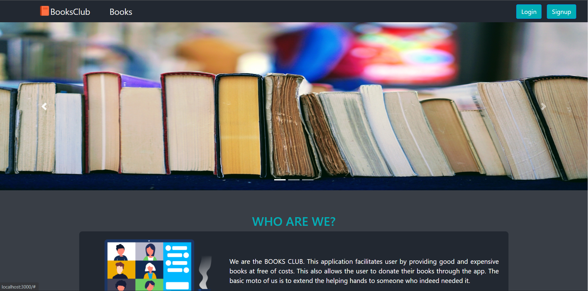
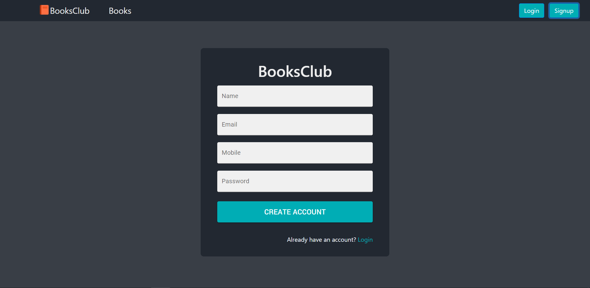
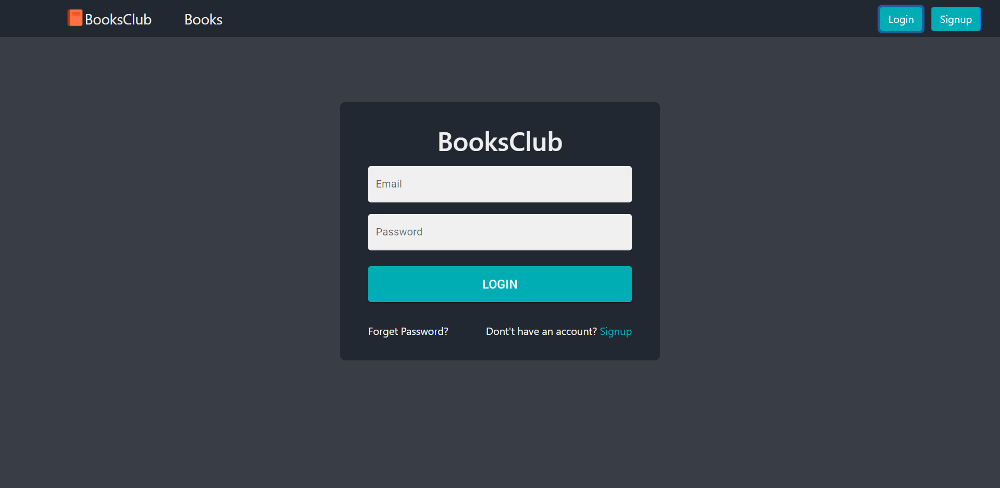

# BooksClub (Hackathon)

[](https://travis-ci.org/joemccann/dillinger)

BooksClub is an online platform that allows you to provide unused books to needy people. One has to upload the details of the books and if the book is still available then the needy one can get it for free by accessing the details. This project was built within 48 hours as a part of a hackathon at Masai School by our team of web warriors.

<!-- **To see the live site click the below link.** -->


## Installing and Running

Executing the commands mentioned below one by one in your command line will help in making this React app .
**Cloning**

```
git clone https://github.com/sheikhtausif/books-club
cd ./books-club
```

**To run the react app execute below command**

```
cd ./client
npm install
npm start
```
**To run the server app execute below command**

```
cd ./server
npm install
npm run dev
```

## Built with
<ul>
  <li>React js</li>
  <li>Redux</li>
  <li>HTML</li>
  <li>CSS</li>
  <li>JavaScript</li>
</ul>

## Used libraries
<ul>
  <li>node modules</li>
  <li>Styled-Components</li>
  <li>axios</li>
  <li>React Js</li>
  <li>Redux</li>
  <li>React-router-dom</li>
  <li>Material-UI</li>
  <li>Material-Icons</li>
  <li>React Icons</li>
</ul>

## Features
<ul>
  <li>Signin/Signup</li>
  <li>Users can add Books</li>
  <li>Users can get the available books for free</li>
  <li>Users can filter and search</li>
</ul>

  
## Some screenshots of the project





## Team members
<ul>
  <li>Mohd Tausif</li>
    <ul>
      <li>Gmail (mohammadtausif14@gmail.com)</li>
      <li>Github <a href="https://github.com/sheikhtausif">https://github.com/sheikhtausif</a></li>
    </ul>
  <li>Vaibhav Raj</li>
    <ul>
      <li>Gmail (vaibhavraj524@gmail.com)</li>
      <li>Github <a href="https://github.com/vaibhav-raj">https://github.com/vaibhav-raj</a></li>
    </ul>
  <li>Pawan Patidar</li>
    <ul>
      <li>Gmail (pawanpatidar21@gmail.com)</li>
      <li>Github <a href="https://github.com/pawanpatidar21">https://github.com/pawanpatidar21</a></li>
    </ul>
  <li>Sumit Bhandari</li>
    <ul>
      <li>Gmail (bhandarisumit049@gmail.com)</li>
      <li>Github <a href="https://github.com/samy721">https://github.com/samy721</a></li>
    </ul>
</ul>

